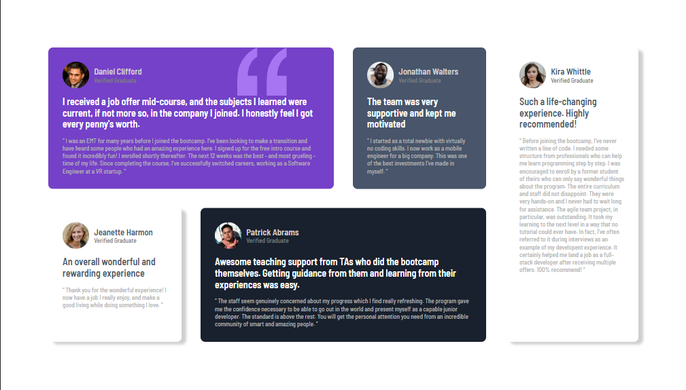

# Desafio Página de Avaliações - Frontend-Mentor

Este é um desafio de uma Página de Avaliações proposto pelo site Frontend-Mentor.

## Tabela de Conteúdos

- [Visão Geral](#visão-geral)
    - [Imagens](#imagens)
    - [Link da página](#link)
- [Processo](#processo)
    - [Linguagens utilizadas](#linguagens-utilizadas)
    - [O que aprendi](#o-que-aprendi)
    - [Possíveis evoluções](#possíveis-evoluções)
- [Autor](#autor)

## Visão-geral

### Imagens

<br>

````
Versão de Desktop
````

   

<br>

````
Versão Mobile
````

 

### Link

- Página no GitHub Pages: <a href="https://julio-mansan2.github.io/layout-de-avaliacoes/">Clique aqui!</a>

## Processo

### Linguagens utilizadas

<br>

- Marcações semânticas de HTML5
- Propriedades de customização do CSS3

<br>

### O que aprendi

<br>

- Utilizar o display grid, bem como suas propriedades essenciais

````css

.container {

    display: grid;
    grid-template-areas:
    "daniel daniel jonathan kira"
    "jeanette patrick patrick kira";
    grid-template-columns: repeat(4, 1fr);

}

````
<br>


- Utilizar o grid-area

````css

.daniel {

    grid-area: daniel

}

.jonathan {

    grid-area: jonathan

}

````
<br>


- Configurar o background-position com porcentagem

````css

.container {

    background-position: 80% (X) 0% (Y)

}

````
<br>

### Possíveis evoluções

<br>

- Utilizar melhor os seletores múltiplos de classes;
- Configurar "font-weight" de forma mais precisa.

<br>

## Autor

GitHub - <a href="https://github.com/julio-mansan2">julio-mansan2</a> <br>
Front-end Mentor - <a href="https://www.frontendmentor.io/profile/julio-mansan2">julio-mansan2</a> <br>